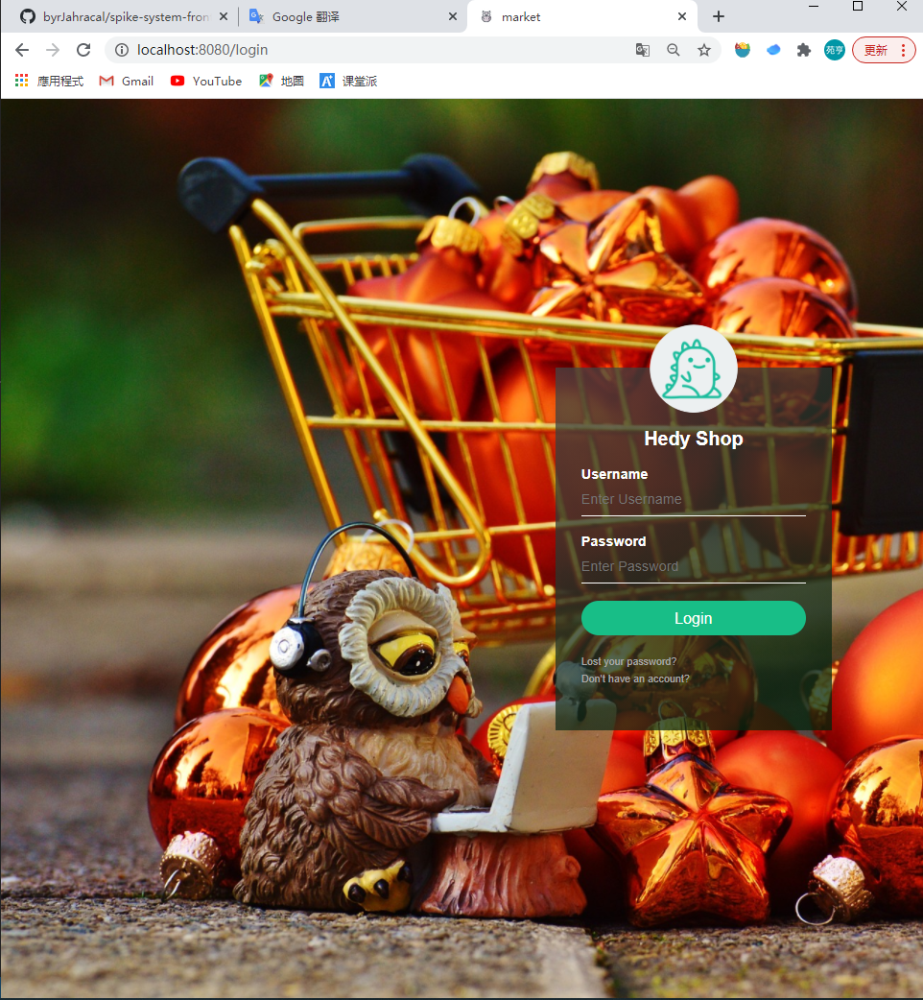

# Hedy Shop线上购物平台(秒杀系统)——前端

***后端项目地址（https://github.com/byrJahracal/spike-system-back-end）***

## 简介

​本项目实现了一个线上购物平台，面向买家和卖家。买家可以在系统中购买和秒杀物品，购买物品会直接返回结果，秒杀则会生成秒杀订单，记录秒杀结果。另外买家还可以在系统中充值。卖家则可以对商品的名称、价格、库存、描述、种类等进行编辑，还可以查看所有的秒杀订单。秒杀机制为当商品的库存余量小于100时购买功能自动变为秒杀功能。卖家和买家无法查看对方的界面，也无法触及对方的功能，前后端都有身份验证相关的机制。另外系统还使用了token实现3天免登陆的功能。

## 运行
需要先手动安装好node.js环境，之后在本目录下运行`npm run serve`即可。

## 效果

## 说明
更多详细说明可在document中查看。后端实现以及整体架构请查看后端的项目仓库。
