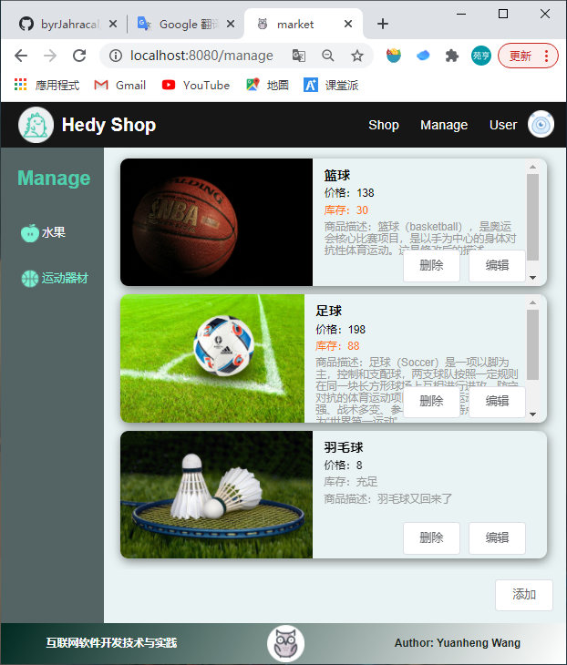
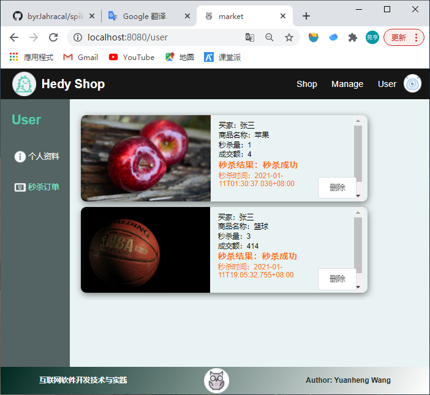

# Hedy Shop线上购物平台(秒杀系统)说明文档——前端

## 简介

​		本项目实现了一个线上购物平台，面向买家和卖家。买家可以在系统中购买和秒杀物品，购买物品会直接返回结果，秒杀则会生成秒杀订单，记录秒杀结果。另外买家还可以在系统中充值。卖家则可以对商品的名称、价格、库存、描述、种类等进行编辑，还可以查看所有的秒杀订单。秒杀机制为当商品的库存余量小于100时购买功能自动变为秒杀功能。卖家和买家无法查看对方的界面，也无法触及对方的功能，前后端都有身份验证相关的机制。另外系统还使用了token实现3天免登陆的功能。

## 系统功能展示

- 登录

  - 登录页面

    

  - 登录失败

    

  - 登录成功 (卖家)(直接跳转)

    

- 卖家功能

  - 切换菜单

    

  - 修改商品

    

    

  - 删除商品

    

  - 添加商品

    

    

  - 查看个人资料（在右上角切换界面到User）

    

  - 查看所有秒杀订单

    

  - 删除秒杀订单

    

  - 退出登录

    

- 买家功能

  - 购买商品(还有充值)

    

    

    前往充值

    

    

    再次购买

    

    

    查看余额

    

  - 秒杀商品(当商品数量小于100时自动变为秒杀)(包含查看秒杀订单)

    

    

    查看秒杀订单(买家只能看自己的订单)

    

  - 其余功能包括：退出登录，切换菜单，删除订单记录等与卖家相同，这里不做展示。

## 前端实现

- 前端架构

  前端使用了vue架构，运行在node.js中。

  

  assets目录中是一些css文件和图片资源。

  components中是一些可以复用的vue组件。

  network中是所有和网络请求有关的函数。

  router中是路由配置。

  store中是集中数据存储和处理的逻辑。

  views中是各种视图页面。

  App.vue是前端的入口，可以看到这里只动态显示一个header和footer，中间的主体部分由路由决定。

  

- views

  

  

  views中主要有4个大的视图，分别是login，manage，shop和user对应登录界面，卖家界面，买家界面和用户界面。login界面打开时会自动判断本地是否有token，如果有token则自动发送登录认证请求。其余三个界面打开时会自动发送请求获取目录表项。

- router

  

  

  router中配置了路由，并且有拦截器函数。login页面访问不需要查看身份，访问其余页面则需要验证身份，如果没有登录自动跳转到login，如果卖家想访问买家界面则自动跳转到卖家界面等。

- store

  

  

  store中存储了一些目录表象，商品信息，用户信息等操作，以及对其的同步和异步操作。

- network

  

  

  network中是所有和网络请求相关的操作，全部使用axios进行请求。另外还包括对token的处理，包括使用localStore存储token，每个请求都要在header中加入token，如果服务器返回认证错误或者token过期还要删除本地token。

